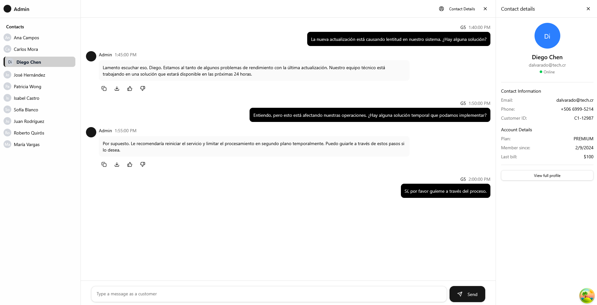

# NexTalk - Chat Support Library



)

## 🚀 Descripción

NexTalk es una biblioteca de chat de soporte moderna y elegante construida con React y TypeScript. Este proyecto fue desarrollado como parte del curso de React Router de [Fernando Herrera](https://fernando-herrera.com) en [DevTalles](https://devtalles.com/), implementando las mejores prácticas y patrones modernos de desarrollo React.

## ✨ Características

- 💬 Chat en tiempo real con interfaz moderna
- 👤 Gestión de contactos con detalles de cliente
- 📱 Diseño totalmente responsive
- 🎨 Temas personalizables con Tailwind CSS
- 🔒 Sistema de autenticación integrado
- ⚡ Rendimiento optimizado con React Query
- 🎯 Tipado fuerte con TypeScript
- 🛠️ Componentes reutilizables con Shadcn/ui

## 🛠️ Tecnologías

- **React** - Biblioteca de UI
- **TypeScript** - Superset de JavaScript tipado
- **Tailwind CSS** - Framework de CSS utilitario
- **React Router** - Enrutamiento
- **React Query** - Gestión de estado y caché
- **Shadcn/ui** - Componentes de UI
- **Lucide React** - Iconos

## 📦 Instalación

1. Clona el repositorio:
```bash
git clone https://github.com/tuusuario/support-chat-library.git
cd support-chat-library
```

2. Instala las dependencias:
```bash
npm install
```

3. Inicia el servidor de desarrollo:
```bash
npm run dev
```

## 🏗️ Estructura del Proyecto

```
src/
├── auth/               # Componentes y lógica de autenticación
├── chat/              # Componentes principales del chat
│   ├── components/    # Componentes reutilizables
│   ├── interfaces/    # Tipos y interfaces
│   ├── layout/        # Layouts del chat
│   └── pages/         # Páginas del chat
├── components/        # Componentes UI compartidos
└── lib/              # Utilidades y configuraciones
```

## 💡 Uso

1. **Autenticación**
   - Implementa el sistema de login/registro
   - Gestión de sesiones de usuario

2. **Chat**
   - Lista de contactos con búsqueda
   - Panel de detalles de cliente
   - Historial de conversaciones
   - Envío de mensajes en tiempo real

3. **Personalización**
   - Temas personalizables
   - Configuración de componentes
   - Estilos adaptables

## 🔧 Configuración

### Variables de Entorno

Crea un archivo `.env`:

```env
VITE_API_URL=tu_url_api
VITE_AUTH_TOKEN=tu_token_auth
```

### Configuración del Chat

Puedes personalizar el comportamiento del chat en `src/chat/config.ts`:

```typescript
export const chatConfig = {
  messageLimit: 50,
  refreshInterval: 5000,
  // ... más configuraciones
}
```

## 📝 Scripts Disponibles

- `npm run dev` - Inicia el servidor de desarrollo
- `npm run build` - Construye el proyecto para producción
- `npm run preview` - Previsualiza la build de producción
- `npm run lint` - Ejecuta el linter
- `npm run test` - Ejecuta los tests

## 🤝 Contribución

1. Fork el proyecto
2. Crea tu rama de características (`git checkout -b feature/AmazingFeature`)
3. Commit tus cambios (`git commit -m 'Add: nueva característica'`)
4. Push a la rama (`git push origin feature/AmazingFeature`)
5. Abre un Pull Request

## 📄 Licencia

Este proyecto está bajo la Licencia MIT - ver el archivo [LICENSE.md](LICENSE.md) para más detalles.

## 👥 Autores

- Tu Nombre - [@tuusuario](https://github.com/tuusuario)

## 🙏 Agradecimientos

- [Fernando Herrera](https://fernando-herrera.com) y [DevTalles](https://devtalles.com/) por el excelente curso de React Router
- [Shadcn/ui](https://ui.shadcn.com/) por los componentes base
- [Tailwind CSS](https://tailwindcss.com/) por el sistema de estilos
- [React Query](https://tanstack.com/query/latest) por la gestión de estado

## 📚 Recursos de Aprendizaje

Este proyecto forma parte del curso de React Router de DevTalles. Si estás interesado en aprender más sobre:
- Implementación avanzada de React Router
- Patrones de diseño en React
- Gestión de estado con React Query
- Desarrollo de aplicaciones modernas con TypeScript

Visita [DevTalles](https://devtalles.com/) para más información sobre el curso completo.
